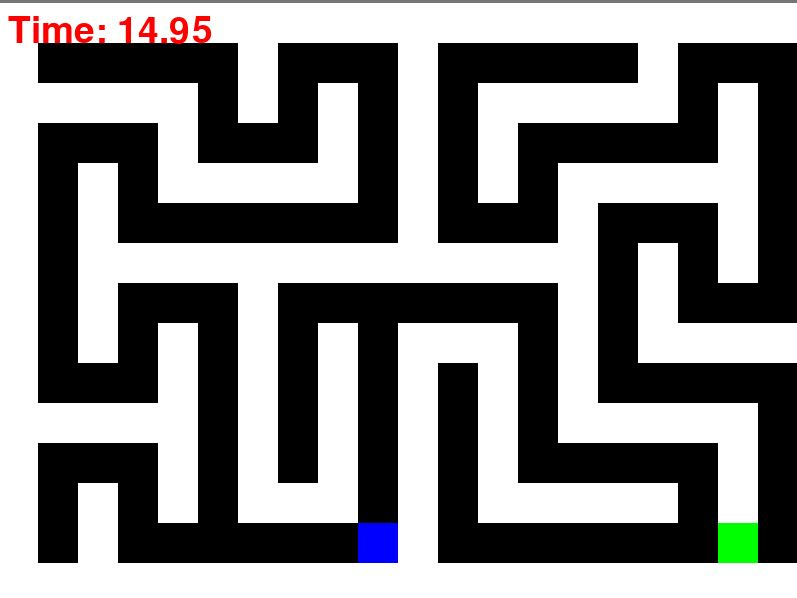

# Maze Game

This is a simple maze game created using Python and Pygame. The objective of the game is to navigate through a randomly generated maze to reach the green exit tile. The game consists of multiple levels, and the difficulty increases with each level.

## Features

- Randomly generated mazes for each level.
- Simple movement using arrow keys.
- Visual feedback on reaching the exit.
- Timer to track how long it takes to complete the game.

## Installation

1. Ensure that you have Python installed on your system. You can download it from [python.org](https://www.python.org/).

2. Install the Pygame library by running the following command in your terminal or command prompt:

    ```bash
    pip install pygame
    ```

3. Download the source code of the game from this repository.

## How to Run the Game

1. Navigate to the directory containing the game script in your terminal or command prompt.

2. Run the following command:

    ```bash
    python maze_game.py
    ```

3. The game window will open, and you can start playing by using the arrow keys to move the player.

## Controls

- **Arrow Keys**: Move the player (blue square) through the maze.
- **Objective**: Reach the green exit square to advance to the next level.

## Game Levels

- The game consists of 3 levels.
- The maze layout changes with each level.
- The game ends with a "You Win!" screen after completing all levels.

## Modifying the Game

If you want to modify the game (e.g., change the number of levels, screen size, or colors), you can do so by editing the following variables in the code:

- `SCREEN_WIDTH`, `SCREEN_HEIGHT`: Change the size of the game window.
- `TILE_SIZE`: Adjust the size of each tile in the maze.
- `LEVELS`: Change the number of levels in the game.
- `WHITE`, `BLACK`, `BLUE`, `GREEN`, `RED`: Modify the color values used in the game.


